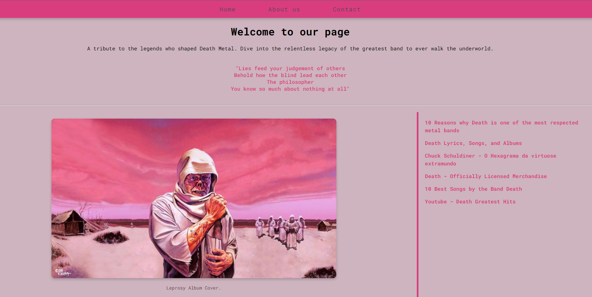
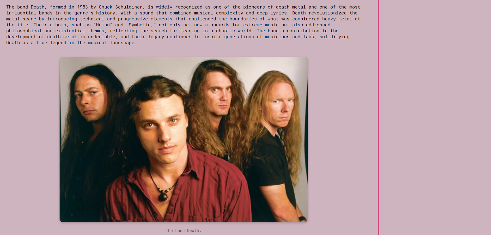

# Death Band Tribute Website

This project is a tribute webpage for the legendary metal band Death, developed using HTML and CSS. The goal is to create a simple yet informative page containing core web elements such as a header, navigation menu, main content section, aside, and footer.

This is a exercise created for the FullStack Developer course by +praTi and Codifica group.

## 🎯 Objective

Develop a webpage using HTML and CSS that includes the main elements of a typical website structure.

## 🖼️ Preview

## 🛠️ Project Structure

The website is composed of the following sections:

- Header: Contains the website's title and a simple navigation menu with three fictitious links (e.g., Home, About, Contact).
- Section: Serves as the main content area, including a brief introduction to the band Death, its history, and influence in the metal scene. It also features images with descriptive captions.
- Aside: Contains a list of external links that provide more information and resources related to the band.
- Footer: Displays copyright information and credits for the page.

## 🌟 Features

- Responsive design using CSS Flexbox for a clean and modern layout.

- Custom color scheme defined with CSS variables for easy maintenance.

- Interactive hover effects that enhance user experience.
  Image gallery with alt text for better accessibility.

## 🚀 How to Run the Project

To run this project locally, follow these steps:

1. Clone the repository:
   `git clone https://github.com/Jesschuck/death-band-tribute.git
`

2. Navigate to the project directory:
   `cd death-band-tribute
`

3. Open the index.html file in your browser:
   `open index.html
`

Or you can right-click on index.html and select "Open with" and choose your preferred browser.
